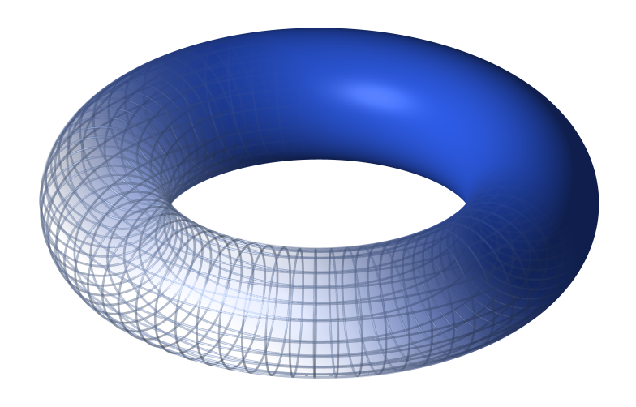
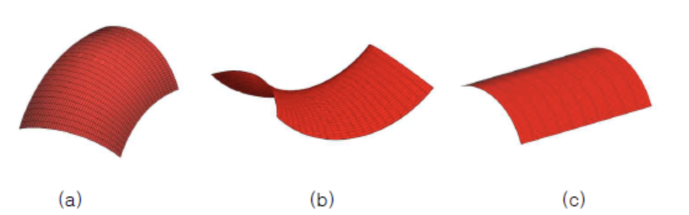

# Torus란?

토러스(Torus)는 수학적인 용어로, 도넛 모양을 나타냅니다. 3차원 유클리드 공간에서 토러스는 주로 원을 360도 회전하는 형태로 정의됩니다. 토러스는 주로 다양한 수학적 응용뿐만 아니라 컴퓨터 그래픽, 물리학, 공학 등 다양한 분야에서 사용됩니다.

## Torus Patch란?
Torus patch는 3차원 그래픽이나 컴퓨터 그래픽에서 토러스를 나타내는 방법 중 하나입니다. 이것은 주로 그래픽 소프트웨어나 렌더링 엔진에서 사용됩니다.

### Torus Patch의 특성

> - 매개변수화된 표현: 토러스 패치는 일반적으로 매개변수화된 방식으로 정의됩니다. 이것은 토러스의 형태를 결정하는 매개변수를 사용하여 정확한 위치와 모양을 제어할 수 있게 합니다.
> - 곡면 형태: 토러스 패치는 둥근 모양을 가진 곡면으로 이루어져 있습니다. 주로 두 개의 반지름, 즉 큰 반지름과 작은 반지름을 사용하여 정의됩니다.
> - 3D 모델링에서 사용: 토러스 패치는 3D 모델링 소프트웨어에서 다양한 형태의 객체를 만들기 위해 사용됩니다. 특히, 부드러운 곡면을 생성하고 복잡한 형태를 만드는 데 사용됩니다.
> - 렌더링: 렌더링 시스템에서 토러스 패치는 조명과 재질 속성을 적용하여 실제같은 이미지를 생성하는 데 사용됩니다.