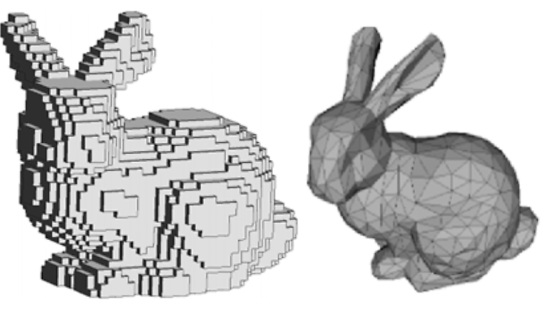

# Voxel과 Mesh의 장단점

- 기존의 2D 시대에서 1024 X 1024크기의 RGB 이미지를 생각해 보았을 때 3백만 회의 연산이 필요하다. 하지만 3D로 올라가며 30억회의 연산이 필요함으로 많은 방법론이 제기 되었고 그 방법론이 Voxel과 Mesh이다.

## Voxel의 장단점
- 장점
> 1. 자연스러운 표현: Voxel은 3차원 공간을 그대로 표현하기 때문에 자연스러운 시각적 표현이 가능합니다. 특히 고해상도의 Voxel을 사용하면 세밀한 디테일을 표현할 수 있습니다.
> 2. 인공지능에 적합: Voxel은 고정된 구조를 가지고 있어 인공지능 모델에서 쉽게 활용할 수 있습니다. 각 픽셀마다 RGB 값과 같은 정보를 가지고 있어 이미지 처리와 유사한 방식으로 다룰 수 있습니다.
> 3. 복잡한 형태 표현 가능: Voxel은 복잡한 형태의 객체를 표현하는 데에도 유용합니다. 객체의 내부와 외부를 동시에 표현할 수 있어 의료 이미징이나 자율 주행 자동차와 같은 분야에서 활용될 수 있습니다.

- 단점
> 1. 연산량 문제: 고해상도의 Voxel을 다룰 때는 연산량이 많아지는 문제가 있습니다. 세제곱의 연산량이 필요하기 때문에 대규모의 3D 데이터를 다룰 때는 높은 성능의 하드웨어가 필요합니다.
> 2. 메모리 요구량: 고해상도의 Voxel을 다룰 때는 메모리 요구량이 매우 커집니다. 대용량의 메모리가 필요하거나 데이터 압축 알고리즘이 필요할 수 있습니다.
> 3. 해상도와 품질 사이의 상충관계: 연산량과 메모리 요구량 문제로 인해 고해상도의 Voxel을 사용할수록 세밀한 표현이 가능하지만, 이로 인해 품질과 연산 비용 사이에 상충관계가 발생할 수 있습니다.

## Mesh의 장단점
- 장점
> 1. 효율적인 표현: Mesh는 삼각형으로 표현되기 때문에 각 점을 연결하는 선이 직선이며, 이를 통해 복잡한 형태도 간결하게 표현할 수 있습니다. 또한, 삼각형의 정보만을 저장하기 때문에 메모리 사용량이 비교적 적습니다.
> 2. 범용성: Mesh는 그래픽 관련 기술에서 널리 사용되는 방법으로, 다양한 응용 분야에서 활용할 수 있습니다. 게임 개발, 시뮬레이션, 공학적 모델링 등 다양한 분야에서 사용되며, 다양한 파일 형식으로 저장하고 공유할 수 있습니다.
> 3. 다양한 연산 가능: Mesh 데이터는 다양한 연산을 수행할 수 있습니다. 예를 들어, 거리 계산, 표면 노말 계산, 충돌 감지 등 다양한 처리를 통해 물체 간 상호작용을 시뮬레이션할 수 있습니다.

- 단점
> 1. 복잡한 데이터 구조: Mesh는 삼각형으로 표현되기 때문에 복잡한 형태의 물체를 표현할 때는 많은 삼각형이 필요할 수 있습니다. 이로 인해 복잡한 데이터 구조를 다루어야 하므로 처리 속도가 느려질 수 있습니다.
> 2. 메모리 요구량: 높은 해상도의 Mesh를 다룰 때는 많은 메모리가 필요합니다. 특히, 대규모의 Mesh 데이터를 다룰 때는 메모리 부족 문제가 발생할 수 있습니다.
> 3. 인공지능에 대한 적용 어려움: Mesh 데이터는 인공지능 모델에 바로 적용하기 어려울 수 있습니다. Mesh는 점들의 연결 정보로 이루어져 있기 때문에 인공지능 모델에 입력으로 주입하기 위해서는 추가적인 처리가 필요합니다.

