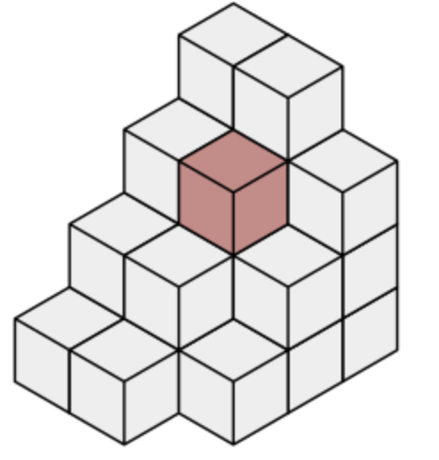
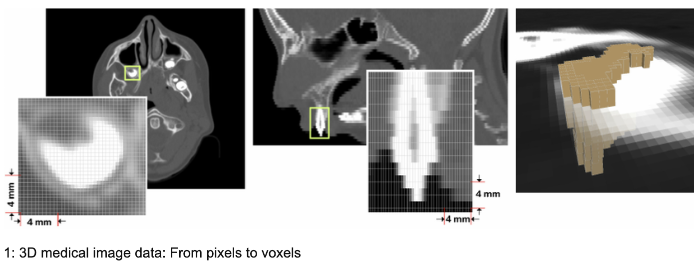
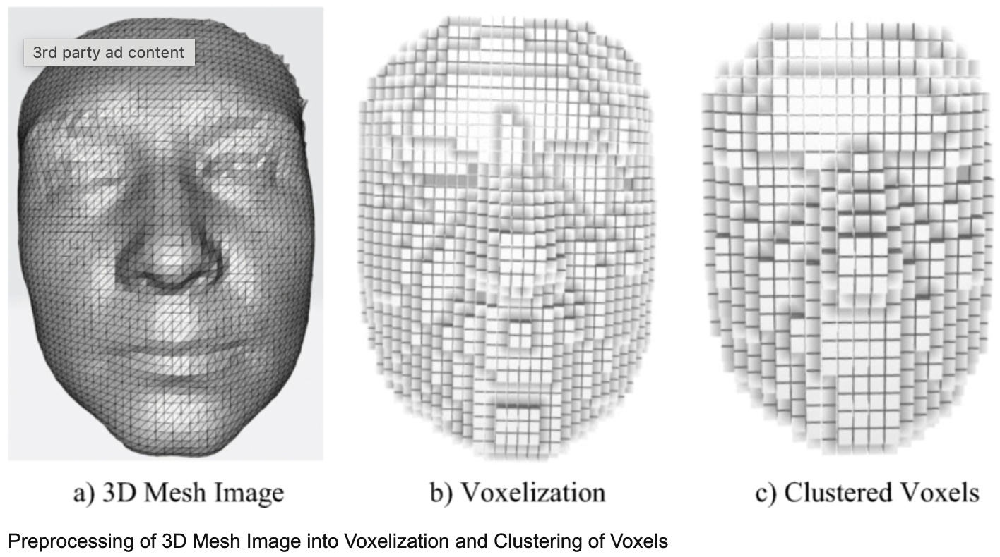

# Voxel이란?

Voxel이란 ‘Volume + Pixel’의 합성어로 부피를 가진 Pixel 

복셀은 3차원 그리드에서 데이터를 표현하는 데 사용되는 3차원 픽셀입니다. 의료 영상 및 컴퓨터 그래픽과 같은 분야에서 볼륨과 세부 구조를 표현하는 데 널리 사용됩니다. 각 복셀은 색상, 밀도 또는 재질 구성과 같은 정보를 저장하여 복잡한 물체와 환경을 사실적으로 시각화하고 분석할 수 있습니다.

## Voxel도 있고 Mesh도 있는데 사용하는 분야가 다른가?

복셀은 의료 영상, 체적 효과를 위한 컴퓨터 그래픽, 지질학 및 물리학 시뮬레이션과 같은 분야에서 체적 데이터를 표현하고 복잡한 내부 구조를 분석하는 데 일반적으로 사용됩니다. 반면에 메쉬는 표면 형상과 세부 구조를 표현하기 위한 컴퓨터 지원 디자인, 애니메이션, 엔지니어링 시뮬레이션, 3D 프린팅과 같은 분야에서 사용됩니다. 각각 고유한 강점이 있으며 애플리케이션의 특정 요구 사항에 따라 사용됩니다.

## Voxel을 사용하는 분야에서 왜 Mesh를 선호하지 않는가?

기존에 복셀을 사용하던 영역에서 복셀 대신 메시를 사용하는 것은 여러 가지 이유로 인해 항상 적합하지 않을 수 있습니다:

- 표현의 복잡성: 복셀은 의료 영상에서 내부 구조나 시뮬레이션의 물리적 특성과 같은 체적 데이터를 표현하는 데 더 적합합니다. 이러한 복잡한 체적 정보를 메시로 표현하는 것은 어렵고 계산 비용이 많이 들 수 있습니다.

- 디테일과 해상도: 복셀은 본질적으로 체적 디테일을 캡처하여 내부 구조나 물리적 특성을 정확하게 표현할 수 있습니다. 메시는 표면을 표현할 수 있지만 메시의 복잡성을 크게 증가시키지 않으면 동일한 수준의 디테일을 캡처하지 못할 수 있습니다.

- 계산 효율성: 복셀은 공간의 점유 영역에 대한 정보만 저장하면 되므로 체적 데이터를 보다 효율적으로 표현할 수 있습니다. 메쉬는 특히 밀도가 높은 경우 많은 메모리와 처리 능력이 필요하기 때문에 체적 데이터에는 효율성이 떨어질 수 있습니다.

- 분석 및 조작: 복셀은 볼륨 렌더링이나 물리 시뮬레이션과 같은 특정 유형의 분석 및 조작에 적합합니다. 메시가 이러한 작업에 적합하지 않을 수 있으며, 특히 본질적으로 체적 특성을 가진 프로퍼티를 다룰 때는 더욱 그렇습니다.

- 특정 애플리케이션 요구 사항: 의료 영상이나 유체 역학 시뮬레이션과 같은 특정 애플리케이션은 해당 분야에서 사용되는 데이터 및 분석 방법의 특정 요구 사항으로 인해 복셀을 사용해야 합니다.

- 특정 시각화 또는 렌더링 작업과 같이 복셀 대신 메시를 사용할 수 있는 경우도 있지만, 일반적으로 체적 데이터 표현과 분석이 가장 중요한 분야에서는 복셀이 선호됩니다.

## 왜 복셀 위에 토러스를 사용할려고 하는가?

토러스 셰이프를 복셀과 함께 사용하면 다양한 애플리케이션에 강력한 조합을 제공하여 다음과 같은 이점을 얻을 수 있습니다:

- 디테일과 사실감: 복셀은 공간의 체적 표현을 제공하지만, 특히 곡면이나 복잡한 표면을 표현할 때 부드러움과 디테일이 부족할 수 있습니다. 복셀 위에 토러스 모양을 오버레이하면 더 세밀한 디테일을 추가하고 매끄러운 표면을 구현하여 렌더링된 장면의 사실감을 향상시킬 수 있습니다.

- 하이브리드 표현: 토러스 셰이프와 복셀을 통합하면 두 가지 접근 방식의 장점을 결합한 하이브리드 표현이 가능합니다. 복셀은 오브젝트나 환경의 전체적인 구조와 볼륨을 표현하는 데 탁월하며, 토러스 셰이프는 특정 영역을 세분화하거나 필요한 곳에 표면 디테일을 추가하는 데 사용할 수 있습니다.

- 효율적인 스토리지: 복셀은 특히 의료 영상이나 과학 시뮬레이션과 같은 애플리케이션에서 체적 데이터를 효율적으로 표현하는 데 탁월합니다. 토러스 모양을 선택적으로 사용하면 전체 볼륨을 고해상도로 표현하는 대신 관심 있는 영역에만 세부적인 표현을 집중함으로써 메모리와 계산 리소스를 절약할 수 있습니다.

- 디자인의 유연성: 토러스 셰이프는 복셀만으로는 표현하기 어려울 수 있는 복잡한 기하학적 특징을 유연하게 정의할 수 있습니다. 두 가지 표현 방식을 결합하면 각 접근 방식의 강점을 활용하여 더욱 다양하고 복잡한 디자인을 구현할 수 있어 광범위한 모델링 요구 사항을 수용할 수 있습니다.

- 향상된 시각화: 토러스 셰이프를 복셀 기반 시각화에 통합하면 렌더링된 장면의 선명도와 해석 가능성을 높일 수 있습니다. 토러스 셰이프는 복셀로 표현된 체적 데이터 내에서 특정 특징이나 관심 영역을 강조하는 시각적 단서 또는 주석 역할을 할 수 있습니다.

- 동적 적응: 게임이나 시뮬레이션과 같은 인터랙티브 애플리케이션에서 복셀과 토러스 셰이프의 조합은 사용자 상호작용이나 계산 제약 조건에 따라 시각적 표현을 동적으로 조정하고 개선할 수 있게 해줍니다. 이러한 적응성을 통해 실시간으로 조정하여 시각적 품질을 유지하면서 성능을 최적화할 수 있습니다.

- 요약하면, 복셀 위에 토러스 셰이프를 사용하면 컴퓨터 그래픽과 시각화에서 과학 모델링과 시뮬레이션에 이르기까지 다양한 애플리케이션에서 세밀하고 사실적이며 효율적인 표현을 달성할 수 있는 다용도 접근 방식을 제공합니다. 개발자는 두 표현의 상호 보완적인 강점을 활용하여 디테일, 효율성, 유연성이 균형을 이루는 매력적인 시각적 경험을 만들 수 있습니다.

\
 **[Voxel의 장단점](./Voxel과%20Mesh의%20장단점.md)**
